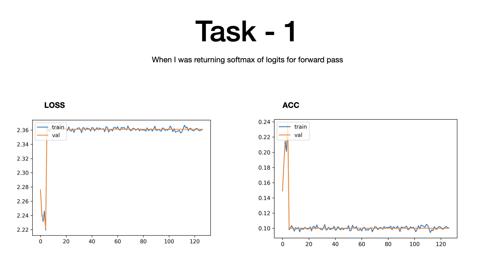
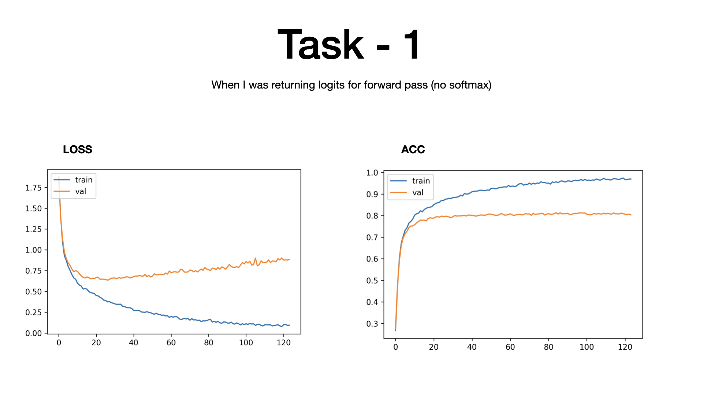
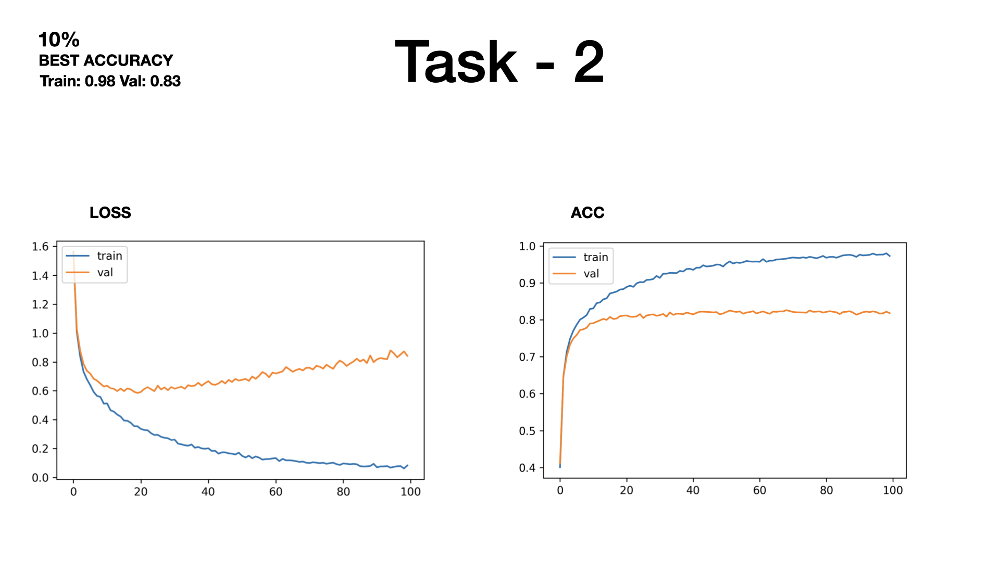
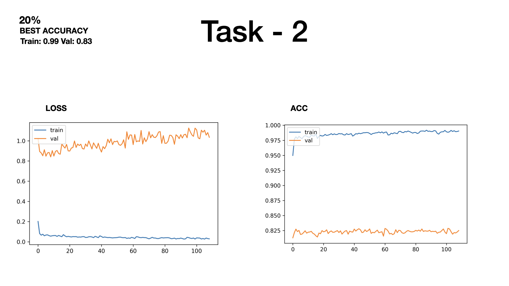
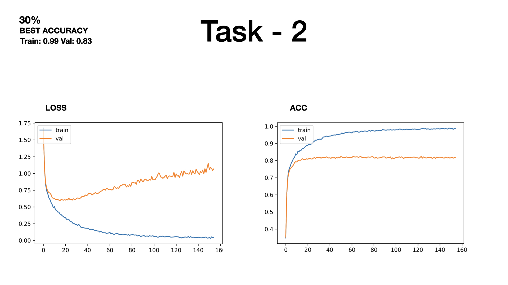
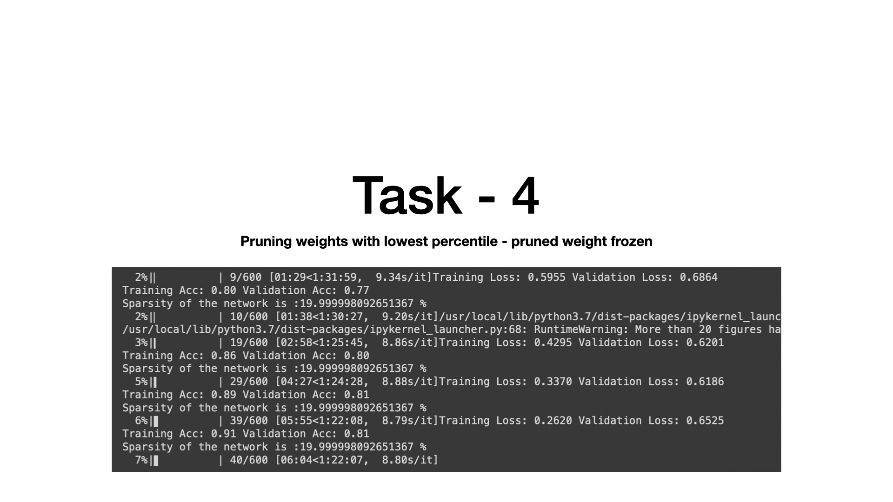
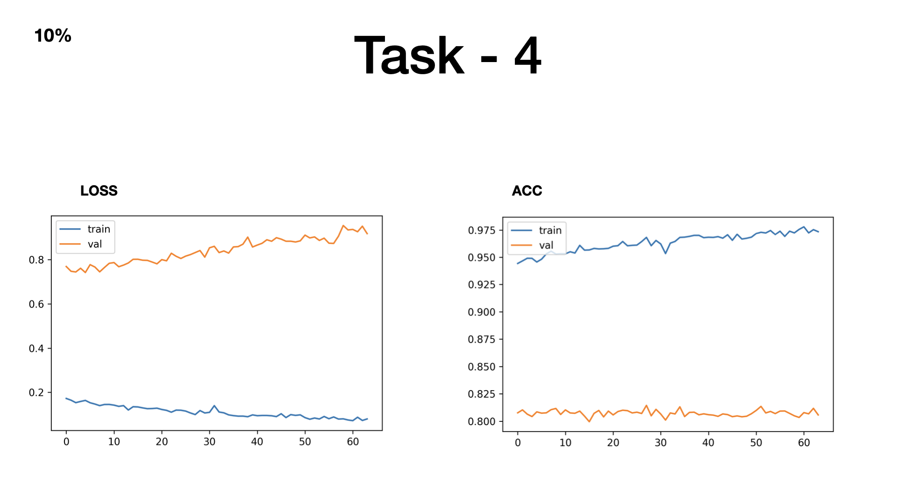
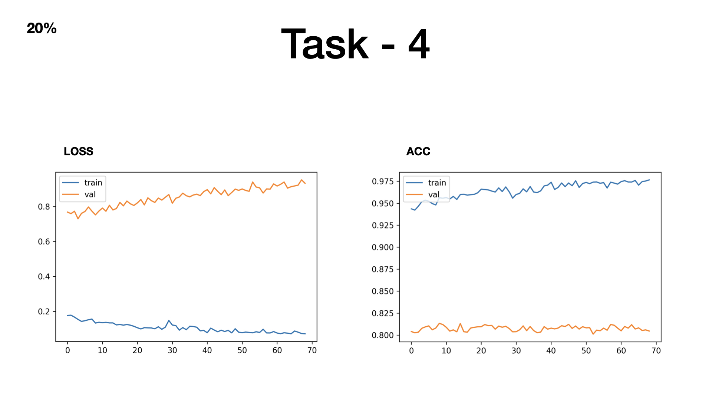
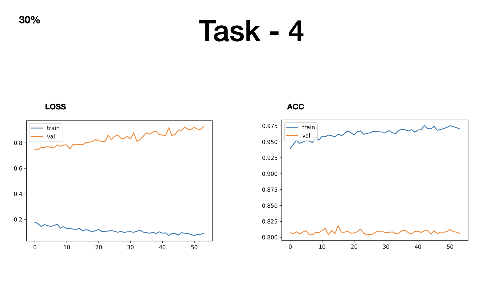

# task-at-hand
programming task with pyotrch and CIFAR-10

# About the Task
The tasks are divided are into four stages primarily:
- Build a model to train on CIFAR10
- Freeze Initial weights of the model
- Prune the lowest 10, 20 and 30%ile of the weights
- Unfreeze the pruned weights to learn their values

# About the Pipeline
I use two classes `Trainer` and `Tester` inspired from PyTorch Lightning. This helps add custom loss functions and optimizers without having to change the training pipeline. After this task I realised that it can be useful for introducing hooks and prune models.

## Task 1
The task required me to train custom Resnet18 model on CIFAR-10 dataset. 
Below is the code snippet of the custom Resnet18 class:
```python
class resnet_for_cifar(nn.Module):  
  
    def __init__(self):  
        super().__init__()  
        # self.resnet = models.resnet18(pretrained=True).to(device)  
        self.model = nn.Sequential(*(list(resnet.children())[:-1]))  
        self.fc1 = nn.Linear(in_features=512, out_features=100, bias=True)  
        self.relu = nn.ReLU(inplace=True)  
        self.fc2 = nn.Linear(in_features=100, out_features=10, bias=True)  
  
    def forward(self, x):  
        x = self.model(x)  
        x = x.squeeze(-1)  
        x = x.squeeze(-1)  
        x = self.fc1(x)  
        x = self.relu(x)  
        x = self.fc2(x)  
        return x
```
Cross entropy Loss is used to compare the probability distribution between the predicted values and the target, So for the first experiment the `forward` function was returning `F.softmax(x)`, for which the results are:

As you can see, It didn't perform as expected, I suspect the reason is vanishing gradients as post softmax the loss value doesn't cause a significant change in the gradients.
Then I tried with the calculating the loss with direct logits(without softmax) and the results were like this:

This further strengthens my theory that calculated loss didn't have enough magnitude to propagate back to the initial layers.
A nice experiment to try would be multiplying the logits resulted from softmax with a scalar to increase their magnitude.

## Task 2
The next task was to freeze some of the initial weights of the model, which can be simply done by `module.requires_grad = False`.
I conducted a total 3 experiments, wherein 10%, 20% and 30% of the initial layers were frozen i.e., those weights can't be updated.

There's not a lot of difference between freezing 10% of the initial weights and not freezing weights at all.

There's something peculiar happening here, as if the model has already achieved its best performance in it's first couple of iterations and it didn't overfit.

For 30% freezing of the initial weights, the behaviour of the model was similar to that of freezing initial 10%.


## Task 3
This task simply asked to prune/mask the lowest 10%, 20% and 30% of the weights. I did it with the help of `torch.nn.utils.prune` and this [tutorial](https://pytorch.org/tutorials/intermediate/pruning_tutorial.html). The code snippet for the same:
```python
def pruning(self, amnt=0.1):  
    pruned_params = params_to_prune(self.model)  
    prune.global_unstructured(  
        pruned_params,  
        pruning_method=prune.L1Unstructured,  
        amount=amnt  
    )
```

## Task 4
The pruned from task 3 is trained on CIFAR-10. The pruned weights are frozen by default. I did a total of 6 experiments for this setup:

<b>Experiment class 1</b>
1) Pruned 10% of the lowest weights of a fine-tuned model
2) Pruned 20% of the lowest weights of a fine-tuned model
3) Pruned 30% of the lowest weights of a fine-tuned model

<b> Experiment class 2 </b>
1) Pruned 10% of the lowest weights of a pre-trained resnet model
2) Pruned 20% of the lowest weights of a pre-trained resnet model
3) Pruned 30% of the lowest weights of a pre-trained resnet model

As you can see in the image above, the sparsity of the network is maintained over the epochs, hence pruning is working.

### Experiment class 1



For all three of these experiments the model has already achieved it's peak performance as it was fine tuned, this is just to confirm that pruning the smallest weight doesn't affect the performance of the model(Lottery ticket hypothesis)
